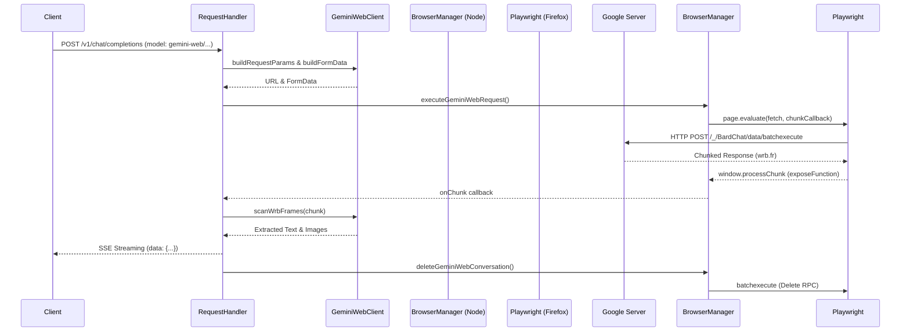

# Gemini Web 接口集成 (Gemini Web Integration) 架构与实现指南

本文档旨在记录 AIStudioToAPI 项目中集成 Gemini Web (gemini.google.com) 功能的完整架构思路、核心逻辑与关键实现细节。为后续的二次开发、BUG 修复或功能扩展提供快速参考。

## 1. 为什么需要 Gemini Web 模式？

原生的 AI Studio 代理功能依赖 WebSocket 通信，但部分模型（如高级版、或某些处于内测期的模型）在 AI Studio 中不可用，或者用户希望通过直接登录 `gemini.google.com` 来白嫖网页版配额。
早期的单纯 HTTP 代理方案面临 Google 极其严格的 Bot 检测和 TLS 指纹检测，普通的 Node.js `fetch` 或 `axios` 会被轻易阻挡 (返回 403 / 429 或 Cloudflare 拦截)。

**破局方案：**
利用本项目中已经集成了 `Playwright` 配合真实 Firefox 浏览器的优势（原本用于绕过 AI Studio 的检测），在真实的浏览器上下文中执行网页版的内部 API（`batchexecute`），完美绕过所有指纹检测。

## 2. 核心架构图

## 3. 核心模块解析

### 3.1 `GeminiWebClient.js` (核心逻辑层)
该模块是无状态的（Stateless），完全不涉及网络请求，只负责数据结构的转换。
* **Payload 构建 (`encodePayload`, `buildFormData`)**：将 OpenAI 的 `messages` 转换为 Google 内部复杂的嵌套 JSON 数组，然后编码为 `batchexecute` 需要的 `f.req` 表单格式。
* **数据帧解析 (`scanWrbFrames`, `extractTextFromWrb`)**：Google 返回的数据是 `wrb.fr` 格式的流，本质上是大量嵌套的 JSON 数组。通过基于括号深度的解析器，精准切分每一帧，并从中提取文本。
* **图片处理 (`extractImagesFromWrb`, `isImageIntent`)**：利用正则在 Prompt 中判断是否包含绘图意图。如果触发绘图，从返回帧中提取图片的 Googleusercontent URL。
* **图片存储 (`saveImage`, `getImagePath`)**：由于安全和跨域限制，AI 生成的图片下载后会在服务器本地临时保存（位于 `data/gemini-web-images/`），并提供对外访问路径。

### 3.2 `BrowserManager.js` (浏览器通信层)
这个模块负责管理 Playwright 生命周期，此次集成增加了大量与 `gemini.google.com` 通信的能力。
* **`contexts.get(authIndex).geminiWebPage`**: 为每个 Google 账号单独维护一个专门访问 `gemini.google.com` 的长链接标签页（隐藏 Tab），以保持会话活跃并保存 Cookie。
* **`SNlM0e` 令牌管理 (`_initGeminiWebTab`, `_maybeRefreshGeminiWebToken`)**: 这是访问网页版接口必须的 Token，从网页的 HTML 代码中通过正则提取。定时任务每 30 分钟刷新一次。
* **`executeGeminiWebRequest` (关键！)**: 利用 Playwright 的 `page.evaluate()` 将 `fetch()` 调用注入到真实的 Firefox 浏览器中执行。利用 `page.exposeFunction` 将 Node.js 端的回调函数挂载到浏览器的 `window` 上，从而实现流式数据的逐块回传。**这是绕过 TLS 鉴定的核心**。
* **垃圾清理 (`deleteGeminiWebConversation`, `cleanupGeminiWebConversations`)**: 为了防止账号下的历史对话堆积，在每次对话生成结束后，会立刻发送隐蔽请求删除该对话（Fire-and-forget）。同时定时任务每小时运行一次，兜底清理可能泄露的对话。

### 3.3 `RequestHandler.js` (路由分发)
* 在 `processOpenAIRequest` 最前端拦截 `gemini-web/*` 开头的模型，并导向 `_handleGeminiWebRequest`。
* 管理流式 (Streaming) 与非流式 (Buffered) 两种响应：
  * **流式**：调用 `BrowserManager` 获取 chunk 后，交由 `GeminiWebClient` 剔除可能带有图片占位符的半截文本 (`filterImagePlaceholders`)，再通过 Server-Sent Events (SSE) 吐给客户端。
  * **非流式/绘图**：如果是绘图请求，必须等待整个请求结束，拿到最后的包含图片数组的帧，然后调用 `BrowserManager` 前往浏览器上下文下载图片（为了绕过 lh3.google 403 限制），保存后拼接出 Markdown 格式丢给客户端。

### 3.4 `StatusRoutes.js` 与 UI
* **`/api/gemini-web/status`**: 供 UI 获取各账号在 Gemini Web 模式下的就绪状态。
* **`/gemini-web/images/:id`**: 本地图片的静态文件路由。
* UI 中增加了专门的 Dashboard 面板，显示哪些账号初始化成功，哪些处于离线状态。

## 4. 后续开发与排错指南 (Troubleshooting)

如果未来 Google 更改了前端代码导致该功能失效，请按以下顺序排查：

1. **Token 提取失败 (获取不到 SNlM0e)**
   * **现象**: 日志报错 "SNlM0e token not available" 或 "Gemini Web not available for this account"。
   * **排查点**: 检查 `BrowserManager.js` 中的 `_initGeminiWebTab` 方法。Google 可能更改了页面 HTML 结构，需要更新正则表达式。

2. **请求返回 400 Bad Request**
   * **现象**: Payload 构造被 Google 拒绝。
   * **排查点**: Google `batchexecute` 内部 JSON 结构 (即 `f.req`) 可能会增加必填字段或修改 RPC ID (当前使用的是 `W2Z5G`)。参考开源社区对 `gemini-web` API 的最新逆向成果，更新 `GeminiWebClient.js` 中的 `encodePayload` 方法。

3. **流式响应解析乱码或丢失**
   * **现象**: 对话没有反应，或中途断裂。
   * **排查点**: `wrb.fr` 的分帧逻辑。检查 `GeminiWebClient.js` 中的 `scanWrbFrames`。Google 返回的换行符或特殊字符可能会打乱基于简单符号平衡的解析器，需增强容错。

4. **历史对话堆积 / 删除失效**
   * **现象**: 用户发现在网页端留下了大量 "无标题对话"。
   * **排查点**: 删除对话使用的 RPC IDs (`GzXR5e` 获取对话列表, `qWymEb` 删除单对话, `MaZiqc` 批量删除) 可能失效。

5. **生成图片失败**
   * **现象**: 图片占位符出现但变成死链接，或 Node 端抛出异常。
   * **排查点**: 下载图片必须在浏览器内使用 `<a download>` 或 `blobUrl` 原理，因为 Googleusercontent 可能会针对 referer 或 sec-fetch 标头做限制。检查 `BrowserManager.js` 中的 `downloadImageViaPage`。

## 5. 开发建议

* 任何涉及向 Google 发送请求的逻辑，**务必**通过 `BrowserManager` 在 `Playwright` 上下文中执行。**绝对不要**在 Node 端直接使用 `axios` 或原生 `fetch`。
* `GeminiWebClient.js` 尽量保持无副作用的纯函数设计，便于编写单元测试，也方便以后跟随 Google 接口的变化进行抽离与热更。
